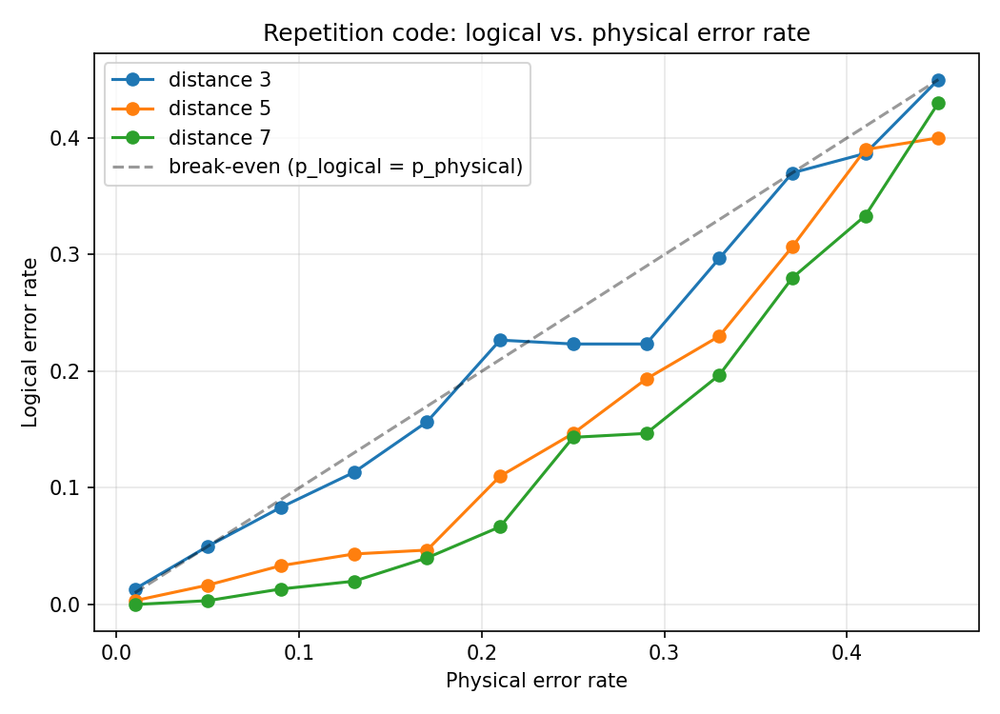

# Repetition Code Simulator

A from-scratch simulator for the quantum bit-flip repetition code — encode, inject noise,
extract syndromes, decode, and measure the logical error rate as a function of the physical
error rate and code distance.

## Why I built this

The repetition code is the simplest real example of the encode → noise → syndrome →
decode pipeline that every quantum error-correcting code follows, including the punctured
Reed-Muller triorthogonal codes I work with for qudit magic-state distillation research at
Fermilab. I wanted a small, fully-transparent implementation where I control every part of
the pipeline (not just calling a library's built-in QEC routine), to build real intuition for
how code distance actually translates into error suppression.

## What it does

1. **Encode** a logical qubit into `d` physical qubits (`d` odd), using CNOT fan-out
2. **Inject** independent bit-flip errors on each physical qubit at rate `p`
3. **Extract syndromes** via parity measurements on ancilla qubits between adjacent data qubits
4. **Decode** the syndrome to the most likely correction (nearest-neighbor majority-vote logic)
5. **Compare** the corrected logical state to the original — repeat over many trials to estimate
   the logical error rate

## Result

Running the distance sweep (`d = 3, 5, 7`) across a range of physical error rates reproduces
the qualitative shape every QEC paper's headline plot has: larger-distance codes suppress
logical error rate faster *below* a threshold physical error rate, and provide *no* benefit
(or actively hurt) above it.



## Usage

```bash
pip install -r requirements.txt
cd src
python run_experiment.py
```

Runtime: ~2-3 minutes on a laptop for the full sweep (3 distances × 12 physical error rates ×
300 trials each). Reduce `trials_per_point` in `run_experiment.py` for a faster, noisier run.

## What I'd do next

- Extend to a real 2D surface code (this repetition code is effectively a 1D surface code —
  it only protects against one error type)
- Swap the hand-written decoder for minimum-weight perfect matching, the standard decoder for
  real surface code experiments
- Compare against Qiskit's built-in noise models instead of manual error injection, to check
  the two approaches agree

## Files

- `src/repetition_code.py` — core encode/noise/syndrome/decode logic
- `src/run_experiment.py` — the distance/threshold sweep and plotting
- `results/threshold_plot.png` — output of the sweep above
- `tests/test_repetition_code.py` — correctness checks against known cases
